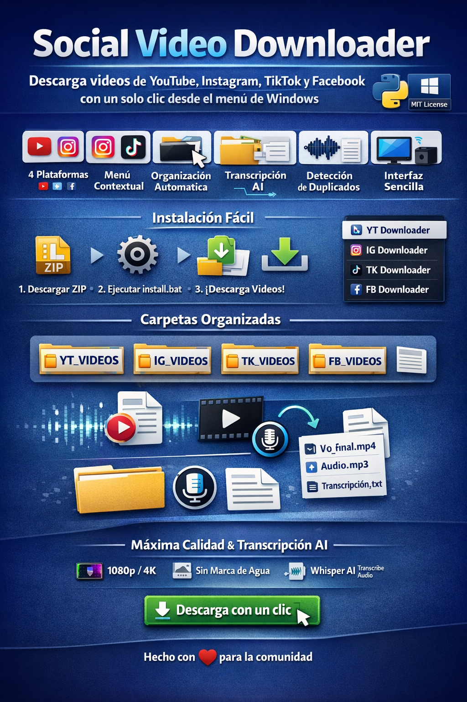

# 🎥 Social Video Downloader



[](https://python.org)
[](LICENSE)
[](https://microsoft.com)

> **Descarga videos de YouTube, Instagram, TikTok y Facebook con un solo clic desde el menú contextual de Windows**

<!-- Para captura de pantalla: abre assets/banner.html en tu navegador y toma screenshot -->

## ✨ Características

- 🎯 **4 Plataformas**: YouTube, Instagram, TikTok, Facebook
- 🖱️ **Menú Contextual**: Acceso directo desde clic derecho en cualquier carpeta
- 📁 **Organización Automática**: Cada video en su propia carpeta
- 📝 **Transcripción AI**: Whisper transcribe automáticamente el audio
- 🔄 **Detección de Duplicados**: Omite videos ya descargados
- 🎨 **Interfaz GUI**: Simple y fácil de usar
- 💾 **Calidad Máxima**: Descarga en la mejor calidad disponible

## 📦 Instalación Rápida

### 1. Pre-requisitos

- Windows 10/11
- [Python 3.8+](https://python.org/downloads)
- [FFmpeg](https://ffmpeg.org/download.html) (opcional pero recomendado)

### 2. Instalar

1. Descarga el ZIP de este repositorio
2. Extrae en cualquier ubicación
3. Ejecuta **`install.bat`** como administrador

```bash
# O instala manualmente las dependencias:
pip install -r requirements.txt
```

### 3. Usar

1. **Haz clic derecho** en cualquier carpeta
2. Selecciona el descargador que necesites:
   - **YT Downloader** - YouTube
   - **IG Downloader** - Instagram (también funciona con Facebook)
   - **TK Downloader** - TikTok
   - **FB Downloader** - Facebook
3. Pega el enlace del video
4. ¡Listo! El video se descargará automáticamente

## 📂 Estructura de Archivos

Los videos se organizan automáticamente:

```
F:\YT_VIDEOS\
└── Título del Video\
    ├── Título del Video_video.webm
    ├── Título del Video_audio.mp3
    ├── Título del Video_final.mp4    ⭐ Video final
    └── Título del Video_audio.txt     📝 Transcripción

F:\IG_VIDEOS\
└── Título del Video\
    ├── Título del Video.mp4          ⭐ Video final
    └── transcripcion.txt              📝 Transcripción

F:\TK_VIDEOS\
└── ... (misma estructura que IG)

F:\FB_VIDEOS\
└── ... (misma estructura que IG)
```

## 🚀 Características Detalladas

### YouTube Downloader
- ✅ Descarga video y audio por separado en máxima calidad
- ✅ Fusiona automáticamente con FFmpeg
- ✅ Transcripción completa con Whisper AI
- ✅ Soporta videos de cualquier duración

### Instagram Downloader
- ✅ Reels, Stories y videos del feed
- ✅ Funciona también con videos de Facebook
- ✅ Descarga directa con audio incluido
- ✅ Transcripción automática

### TikTok Downloader
- ✅ Sin marca de agua
- ✅ Videos HD
- ✅ Transcripción incluida
- ✅ Soporta videos de cualquier longitud

### Facebook Downloader
- ✅ Videos públicos
- ✅ Lives grabados
- ✅ Reels de Facebook
- ✅ Transcripción automática

## ⚙️ Configuración Avanzada

### Cambiar Carpeta de Descarga

Edita el archivo del descargador que quieras modificar:

```python
# En yt-downloader.py, ig-downloader.py, etc.
OUTPUT_DIR = r"F:\YT_VIDEOS"  # Cambia esta ruta
```

### Desinstalar

Ejecuta **`uninstall.reg`** o usa:

```powershell
# Desinstalar desde CMD/PowerShell (como admin)
regedit /s uninstall.reg
```

## 🛠️ Solución de Problemas

### "No Python at..."
Ejecuta el instalador como administrador o verifica que Python esté en el PATH.

### Error de FFmpeg
Instala FFmpeg y añádelo al PATH del sistema:
```bash
# Con winget (Windows Package Manager)
winget install Gyan.FFmpeg
```

### Videos no se descargan
- Verifica tu conexión a internet
- Algunos videos privados o con restricciones de edad no se pueden descargar
- Intenta actualizar yt-dlp: `pip install -U yt-dlp`

## 📋 Requisitos

```
yt-dlp>=2024.1.0
openai-whisper>=20231117
torch>=2.0.0
pydub>=0.25.1
```

## 🤝 Contribuir

¡Las contribuciones son bienvenidas! 

1. Fork el proyecto
2. Crea una rama (`git checkout -b feature/nueva-funcionalidad`)
3. Commit tus cambios (`git commit -m 'Agrega nueva funcionalidad'`)
4. Push a la rama (`git push origin feature/nueva-funcionalidad`)
5. Abre un Pull Request

## 📝 Licencia

Este proyecto está bajo la Licencia MIT - ver [LICENSE](LICENSE) para más detalles.

## 🙏 Créditos

- [yt-dlp](https://github.com/yt-dlp/yt-dlp) - Descarga de videos
- [OpenAI Whisper](https://github.com/openai/whisper) - Transcripción de audio
- [PyTorch](https://pytorch.org/) - Framework de ML

## ⭐ Apoya el Proyecto

Si te gusta este proyecto, ¡dale una estrella en GitHub! ⭐

---

**Hecho con ❤️ para la comunidad**

